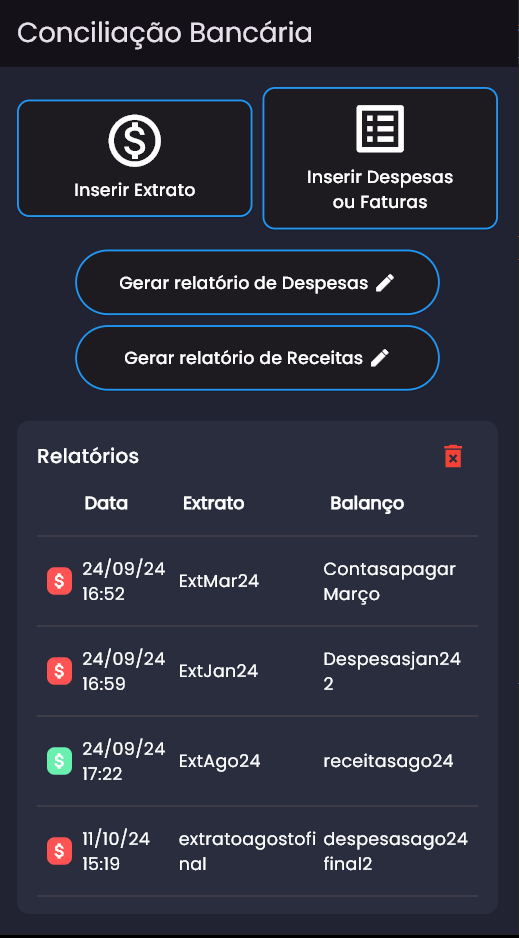
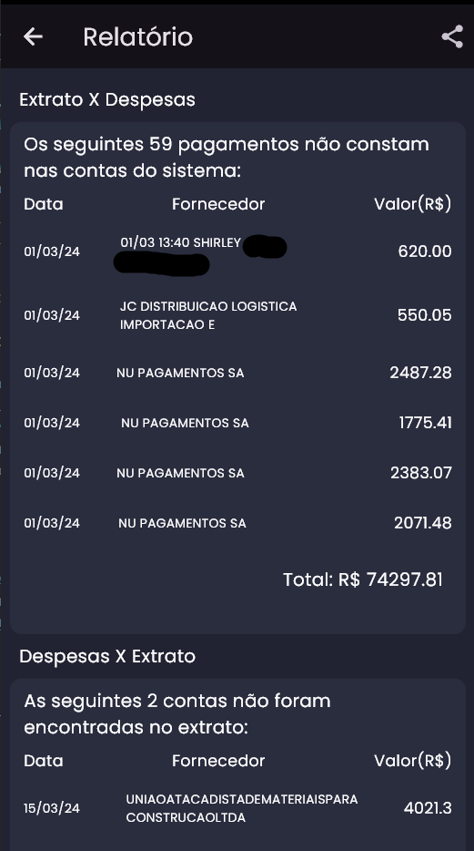
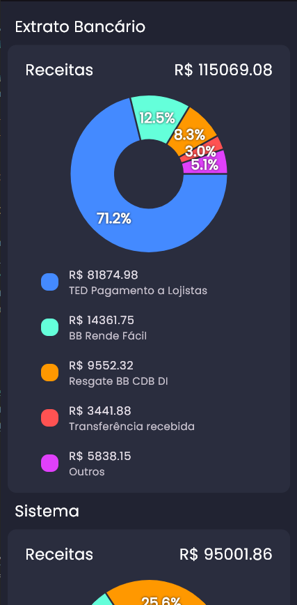

# bank_check

Um aplicativo multiplataforma em desenvolvimento que compara duas planilhas excel com objetivo de gerar
relatórios de conciliação bancária, análise de receitas e por fim gerar o
DRE (Demonstração do Resultado do Exercício) e/ou um pdf para exportação.

## Screenshots

